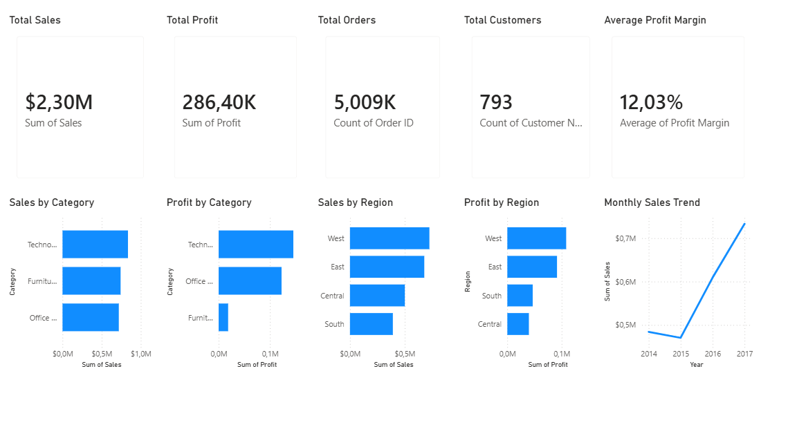

# Retail Sales Data Analytics Project

## 1. Project Overview

This project presents an end-to-end retail sales analytics solution developed using Python, Power BI, and the CRISP-DM methodology. The objective was to analyse historical retail sales data, identify key business trends, investigate factors influencing profitability, develop predictive models, and provide data-driven recommendations to support business decision-making. The project demonstrates the complete analytics lifecycle, from data collection and preparation to descriptive, diagnostic, predictive, and prescriptive analytics.

---

## 2. Business Problem

Retail businesses generate large volumes of transactional data but often struggle to convert this information into actionable insights. Without a structured analysis of sales performance, customer behaviour, product profitability, and regional trends, decision-makers may find it difficult to optimise inventory management, pricing strategies, and marketing efforts. This project aims to transform raw retail sales data into meaningful business intelligence that supports strategic decision-making.

---

## 3. Project Objectives

The objectives of this project were to:

* Analyse overall sales and profit performance.
* Identify the highest and lowest performing product categories.
* Evaluate regional sales and profitability trends.
* Examine customer segment purchasing behaviour.
* Investigate the relationship between discounts and profitability.
* Identify underperforming product sub-categories.
* Build predictive models to forecast sales performance.
* Generate business recommendations to improve profitability and operational efficiency.
* Develop interactive dashboards for business stakeholders.

---

## 4. Dataset Description

The project uses the Sample Superstore dataset obtained from Kaggle. The dataset contains retail transaction records including sales, profit, product information, customer details, discounts, and geographic information.

Key variables include:

* Order ID
* Order Date
* Customer ID
* Customer Name
* Segment
* Region
* Category
* Sub-Category
* Sales
* Profit
* Quantity
* Discount

The dataset contains approximately 9,994 transaction records and 21 variables.

---

## 5. Methodology (CRISP-DM)

The project follows the Cross-Industry Standard Process for Data Mining (CRISP-DM) framework.

### Business Understanding

Defined the business objectives and analytical questions.

### Data Collection

Acquired and loaded the retail sales dataset.

### Data Understanding

Explored dataset structure, variable types, distributions, and data quality issues.

### Data Preparation

Cleaned the data, handled missing values, corrected data types, and prepared features for analysis.

### Feature Engineering

Created additional variables including Profit Margin, Month, Year, and Customer Segment Type.

### Descriptive Analytics

Analysed historical sales and profit performance across categories, regions, and customer segments.

### Diagnostic Analytics

Investigated factors contributing to profitability challenges and explored relationships between discounts and profit.

### Predictive Analytics

Developed and evaluated linear regression models to predict sales performance.

### Prescriptive Analytics

Generated business recommendations based on analytical findings.

---

## 6. Tools and Technologies

### Programming Languages

* Python
  

### Python Libraries

* Pandas
* NumPy
* Matplotlib
* Seaborn
* Scikit-learn

### Data Visualisation

* Power BI

### Version Control

* Git
* GitHub

### Methodology

* CRISP-DM

---

## 7. Key Findings

### Sales Performance

* Technology generated the highest total sales.
* Furniture generated the lowest total sales.
* Consumer customers contributed the largest share of revenue.

### Profitability Analysis

* Technology generated the highest profit.
* Furniture generated the lowest profit despite strong sales performance.
* Office Supplies produced relatively strong profitability compared to its sales volume.

### Regional Performance

* The West region generated the highest sales and profit.
* The Central region demonstrated weaker profitability compared to other regions.

### Discount Analysis

* Furniture received the highest average discount.
* A negative correlation (-0.2195) was identified between discount and profit, suggesting that higher discounts tend to reduce profitability.

### Furniture Investigation

* Tables and Bookcases generated losses.
* Chairs and Furnishings remained profitable.
* Furniture profitability issues appear to be concentrated within specific sub-categories.

### Sales Trends

* Sales exhibited a long-term upward trend.
* Strong seasonal patterns were observed.
* September and November consistently generated high sales volumes.
* November 2017 recorded the highest monthly sales in the dataset.

### Predictive Analytics

* The predictive models demonstrated limited forecasting accuracy.
* Additional business variables and more advanced modelling techniques may improve performance.

---

## 8. Business Recommendations

### Recommendation 1: Review Furniture Discount Strategy

Reduce excessive discounting within the Furniture category and evaluate pricing policies to improve profitability.

### Recommendation 2: Focus on High-Performing Categories

Continue investing in Technology products, which consistently generated strong sales and profit performance.

### Recommendation 3: Address Underperforming Sub-Categories

Investigate Tables and Bookcases to identify pricing, cost, or inventory issues contributing to losses.

### Recommendation 4: Leverage Seasonal Demand

Increase inventory planning and marketing efforts ahead of historically strong sales periods, particularly September and November.

### Recommendation 5: Expand Regional Best Practices

Analyse successful strategies implemented in the West region and apply them to lower-performing regions where appropriate.

---

## 9. Dashboard Screenshots

### Executive Dashboard



Features:

* Total Sales KPI
* Total Profit KPI
* Total Orders KPI
* Total Customers KPI
* Average Profit Margin KPI
* Sales by Category
* Profit by Category
* Sales by Region
* Profit by Region
* Monthly Sales Trend

### Business Insights Dashboard


Features:

* Sales by Segment
* Average Discount by Category
* Furniture Sub-Category Profit Analysis
* Profit by Category

---

## 10. Repository Structure

```text
Retail-Sales-Data-Analytics-Project/

├── data/
│   ├── raw/
│   └── processed/
│
├── notebooks/
│   ├── 01_business_understanding.ipynb
│   ├── 02_data_collection.ipynb
│   ├── 03_data_understanding.ipynb
│   ├── 04_data_cleaning.ipynb
│   ├── 05_feature_engineering.ipynb
│   ├── 06_descriptive_analytics.ipynb
│   ├── 07_diagnostic_analytics.ipynb
│   ├── 08_predictive_analytics.ipynb
│   └── 09_prescriptive_analytics.ipynb
│
├── dashboards/
│   ├── Retail_Sales_Analytics_Dashboard.pbix
│   └── visuals/
│       ├── executive_dashboard.png
│       └── business_insights.png
│
├── report/
├── website/
│   └── github-pages/
│
├── README.md
├── data_dictionary.md
├── methodology.md
├── requirements.txt
└── .gitignore
```

This project demonstrates an end-to-end data analytics workflow, combining data preparation, business analysis, predictive modelling, data visualisation, and business recommendation development using industry-standard tools and methodologies.
